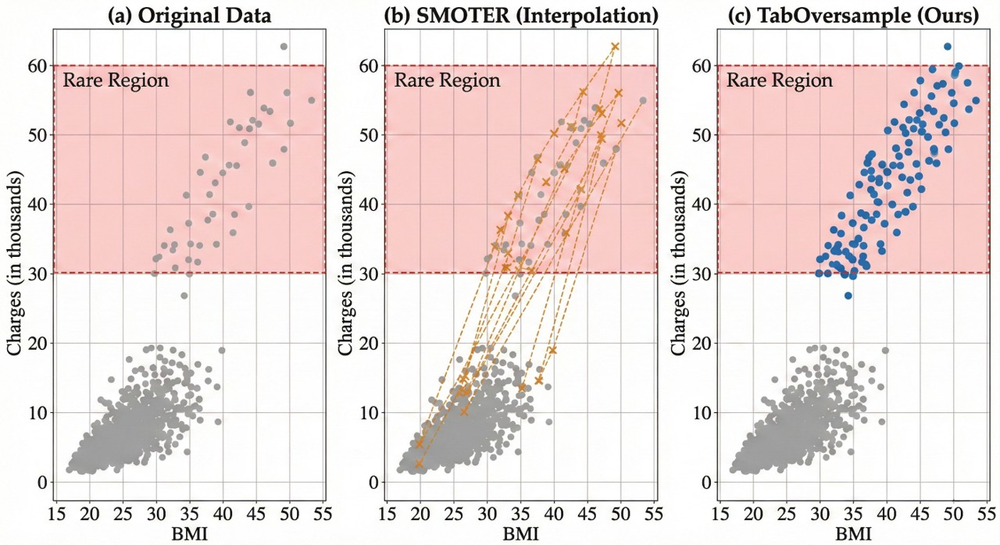
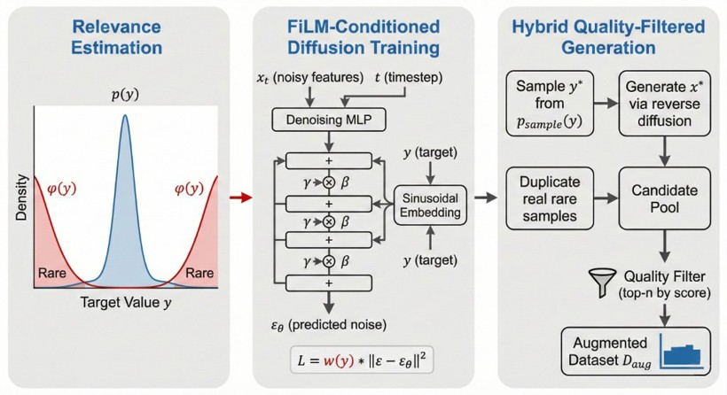

# TabOversample

**TabOversample** is a conditional diffusion framework for **imbalanced tabular regression**: it learns to generate high-fidelity synthetic tabular rows for underrepresented target regions, then uses those rows to train a standard downstream regressor (CatBoost, XGBoost, or MLP).

This repository is the **reference implementation** accompanying the UAI 2026 paper *Conditional Diffusion Models for Imbalanced Tabular Regression*. It contains **source code only**. Benchmark datasets are fetched at runtime via OpenML and scikit-learn. Running the scripts writes CSV and LaTeX summaries under `taboversample/results/` on your machine (not tracked in git).

**Repository:** https://github.com/nathanielkang/taboversample

## Overview

Imbalanced regression arises when certain continuous target ranges are severely underrepresented. Classical oversamplers (e.g., SMOTER) interpolate between existing neighbors and often fail to capture nonlinear conditional structure in the tail. TabOversample instead:

1. **Weights diffusion training** by a box-plot relevance score \(\phi(y)\) so the model focuses capacity on rare target regions.
2. **Samples target values** from a rebalanced distribution and generates mixed-type features with conditional reverse diffusion (Gaussian noise for numerical columns, multinomial diffusion for categorical columns).
3. **Filters candidates** with a denoising score evaluation (DSE) before augmentation.

### Figure 1 — Why interpolation fails in the rare region

Comparison on the Medical Insurance dataset (BMI vs. charges). The shaded band marks the rare high-charge region.

<p align="center">
  
</p>

**(a)** Original training data: dense low-charge cluster and a sparse high-charge tail. **(b)** SMOTER places synthetic points along straight lines between neighbors—an artifact of convex interpolation. **(c)** TabOversample fills the rare region with a diverse cloud that better follows the conditional density.

### Figure 2 — Method pipeline

<p align="center">
  
</p>

**Left:** \(\phi(y)\) highlights underrepresented target regions from the training distribution. **Center:** A conditional tabular diffusion model is trained with relevance-weighted loss; target information is injected via FiLM conditioning at every layer. **Right:** At generation time, targets are drawn from a rebalanced distribution; features are sampled by reverse diffusion; a hybrid pool is quality-filtered with DSE to retain the best synthetic rows.

## Setup

```bash
python -m venv .venv
# Windows:  .venv\Scripts\activate
# Linux/macOS:  source .venv/bin/activate
pip install -r taboversample/requirements.txt
```

PyTorch with CUDA is recommended for diffusion training but not required for a quick CPU smoke run with reduced epochs.

## Quick start

From the repository root:

```bash
cd taboversample
python run_experiments.py --dataset abalone --method tabover --seeds 1 --epochs 50
```

This loads Abalone, runs TabOversample with one seed, and writes outputs locally under `results/` (gitignored).

### Full benchmark

```bash
cd taboversample
python run_experiments.py
```

Optional flags:

```bash
python run_experiments.py --dataset california_housing --method tabover smoter randomos
python run_experiments.py --seeds 10 --epochs 500
python run_experiments.py --regressor catboost
```

## Package layout

| Path | Role |
|------|------|
| `taboversample/tabover.py` | TabOversample training, generation, and DSE filtering |
| `taboversample/diffusion.py` | Gaussian + multinomial tabular diffusion (TabDDPM-style) |
| `taboversample/relevance.py` | Box-plot and density-based relevance functions |
| `taboversample/baselines.py` | SMOTER, SMOGN, RandomOS, TabDDPM-Cond, and related baselines |
| `taboversample/datasets.py` | OpenML / sklearn dataset loaders |
| `taboversample/metrics.py` | SERA, RMSE, RMSE\_rare |
| `taboversample/run_experiments.py` | End-to-end benchmark driver |
| `figures/fig1.jpg`, `figures/fig2.jpg` | Paper Figures 1–2 (motivation and pipeline) |

## Citation

If you use this code, please cite:

```bibtex
@inproceedings{kang2026conditional,
  title     = {Conditional Diffusion Models for Imbalanced Tabular Regression},
  author    = {Kang, Nathaniel},
  booktitle = {Proceedings of the Forty-Second Conference on Uncertainty in Artificial Intelligence (UAI)},
  year      = {2026},
  url       = {https://openreview.net/forum?id=7s70jlkXoW}
}
```

## License

MIT License. See [LICENSE](LICENSE).
